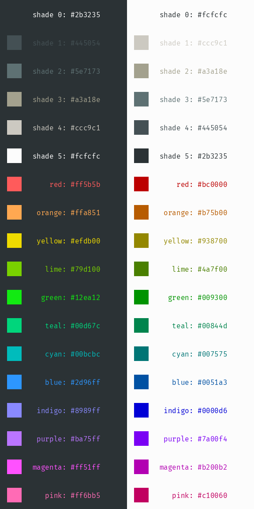

# dots

My personal configurations for various tools.

## Color Scheme

I use a bleeding-edge terminal with an 18 color palette. The colors are
inspired by Solarized and are designed to be readable in a light or dark theme
that can be switched simply by swapping the shades of grey. The palette is
generated with [`colors.py`](colors.py) using parameters from
[`colors.yml`](colors.yml); there's more details about the algorithm inside the
Python script.

## Tooling

Most of the interesting configuration here is for [vim](vimrc),
[tmux](tmux.conf), and [zsh](zshrc). [openbox](openbox-rc.xml) has a fair
amount of custom keybindings to place windows on my screen, but it's hardcoded
to a 3440x1440 resolution monitor.

### Docker workspaces

I describe my dev environment in a [Dockerfile](Dockerfile) and use this image
to spin up clean instances to isolate my various projects and workstreams. This
image contains an up-to-date copy of my ideal dev environment. There is a zsh
function `d()` for creating and entering these workspaces. Executing `d foo`
will create a new Docker workspace named `foo` if it doesn't exist, or enter an
existing `foo` workspace. Likewise, `d foo ls` will execute `ls` inside the
workspace. The `~/dev` container directory is persisted as a bind mount to
`~/.workspaces/foo` on the host.

Using this method allows me to focus on a "stateless" development methodology:
my development environment is completely documented as code and can be deleted
/ re-created completely automatically. This reduces investment and allows me to
have a consistent and reproducible environment on any box with Docker
installed.

### tmux

Because I use tmux so heavily in my workflow, there is a zsh function `t()`
that simplifies the process of creating new sessions and attaching to them.
Simply typing `t foo` will create a new tmux session named `foo` if it doesn't
exist, or attach to an existing `foo` session, while `t foo:bar` will ssh into
`foo` and create/attach to `bar` and `t foo/bar` will enter the `foo` Docker
workspace and create/attach to `bar`.

I have several custom tmux bindings that use alt chords instead of a prefix
chain. Briefly:

* alt+\ splits the pane vertically
* alt+- splits the pane horizontally
* alt+hjkl switch between panes
* alt+mn switch between windows
* alt+, creates a new window
* alt+d detaches from the session
* alt+s switches sessions
* alt+backspace switches pane layouts
* alt+z toggles zoom on the current pane
* alt+w toggles pane synchronization
* alt+; enters the tmux command prompt
* alt+c enters copy-mode; y will copy selection
* alt+p pastes a copied selection

### vim

I use vim for editing all text. I have a relatively minimal plugin setup that
mostly consists of syntax files. I do use
[`skim.vim`](https://github.com/lotabout/skim.vim),
[ALE](https://github.com/w0rp/ale), and
[YouCompleteMe](https://github.com/Valloric/YouCompleteMe) fairly heavily.

I have several custom vim bindings that are explained in my vimrc, but the ones
that I seem to miss the most when working on non-configured systems are
ctrl+hjkl to switch between splits, ctrl+mn to move between buffers, and ctrl+d
to suspend. These mirror the corresponding alt bindings for tmux.
