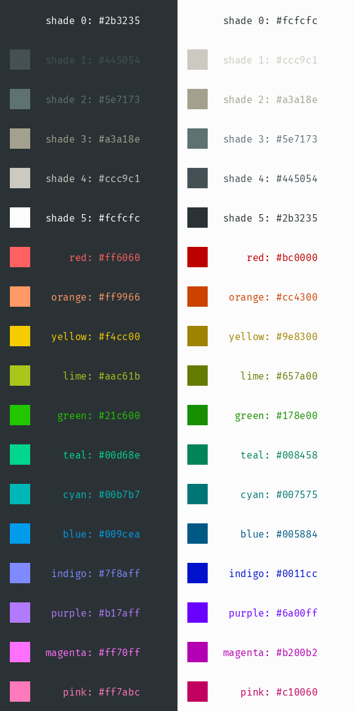

# dots

My personal configurations for various tools.

## Color Scheme

I use a bleeding-edge terminal with a 16 color palette. The colors were
inspired by Solarized, but they've taken quite a big change of direction away
from it these days. The palette is generated with [`colors.py`](colors.py)
using parameters from [`colors.yml`](colors.yml); there's more details about
the algorithm inside the Python script. The light mode palette doesn't look
great because I don't use it often and tend not to optimize it.

## Tooling

Most of the interesting configuration here is for [vim](vimrc),
[tmux](tmux.conf), and [zsh](zshrc).

### tmux

Because I use tmux so heavily in my workflow, there is a zsh function `t()`
that simplifies the process of creating new sessions and attaching to them.
Simply typing `t foo` will create a new tmux session named `foo` if it doesn't
exist, or attach to an existing `foo` session.

I have several custom tmux bindings that use alt chords instead of a prefix
chain. Briefly:

* alt+\ splits the pane vertically
* alt+- splits the pane horizontally
* alt+hjkl switch between panes
* alt+mn switch between windows
* alt+, creates a new window
* alt+d detaches from the session
* alt+s switches sessions
* alt+backspace switches pane layouts
* alt+z toggles zoom on the current pane
* alt+w toggles pane synchronization
* alt+; enters the tmux command prompt
* alt+c enters copy-mode; y will copy selection
* alt+p pastes a copied selection

### vim

I use vim for editing all text. I have a relatively minimal plugin setup that
mostly consists of syntax files.

I have several custom vim bindings that are explained in my vimrc, but the ones
that I seem to miss the most when working on non-configured systems are
ctrl+hjkl to switch between splits, ctrl+mn to move between buffers, and ctrl+d
to suspend. These mirror the corresponding alt bindings for tmux.
